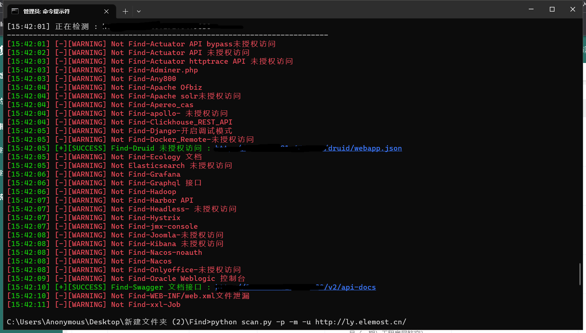
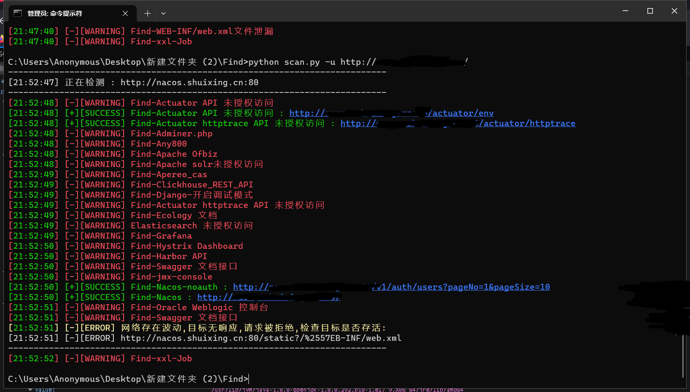
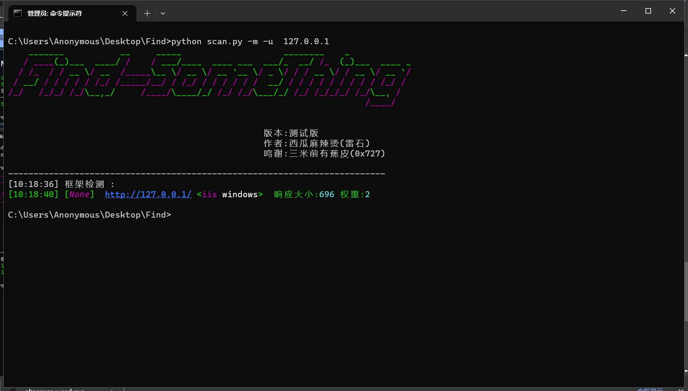

# Find-SomeThing 

### 功能如下

- 指纹识别:调用“三米前有香蕉皮“前辈工具，他的工具比finger好用
- 寻找资产中404，403，以及网页中存在的其他薄弱点，以及需要特定路径访问的资产
- 后续会把nuclei加进来
- 目前只有windows可以用

### 使用

- 第一次使用脚本请运行pip3 install -r requirements.txt
- 安装指纹库 python  scan.py -i
- -u 指定url  会进行指纹识别和脆弱点搜索
- -f 指定文件  会进行指纹识别和脆弱点搜索
- -m 指纹识别  需要配合-u和-f使用 只进行指纹识别
- -p 脆弱点搜索 需要配合-u和-f使用 只进行脆弱点搜索
- -up 更新yaml 跟新规则库中的yaml文件
- i  安装和更新指纹库

### 更新日志5月9日：
增加日志功能
增加更新规则库功能

## 主界面/使用实例

----

## 作者：西瓜麻辣烫

联系方式/问题群聊：
 
 

